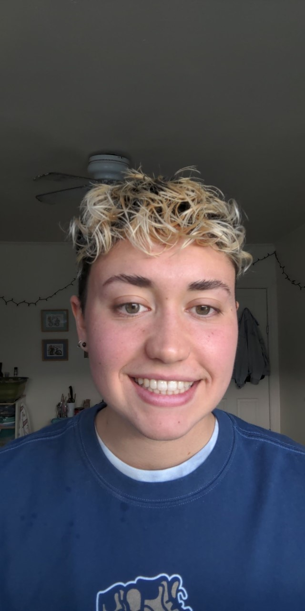

# Reed Williams
## Advanced Web Programming and Development
### Here is some **super** *fun* info about me!

---

1. **Computer Science Background:**
> I am in my final semester of the New Paltz CS Masters Program. Prior to my masters, I received my bachelor’s degree in mathematics from SUNY New Paltz. During my undergrad, I took enough classes to have had a minor in Computer Science, but I never formally declared it. I have taken several classes that cover the basics of java and basic to complex data structures, assembly language and computer architecture, database design, cloud computing, machine learning and data science topics, and cybersecurity. I am most familiar with C, java, python, R, Matlab, Mathematica, and Professor Dos Reis’s assembly language. I have used very basic html and css in my cloud computing class, but I am still at a very low level. I have spent the week going through the w3schools content you suggested, and I am having no problem picking it all up quickly. 

2. **I plan to get the following out of this class:**
> To be completely honest, research I hope to do in the future will primarily deal with the overlapping areas of math and computer science. I have been involved in several applied math research projects in the past-dealing with limnology, epidemiology, neuroscience, and gender studies- and I mostly work with computational modeling techniques. I do not see myself particularly requiring intensive Web Programming skills. However, one thing I am sure my future will hold is teaching. I had numerous peer tutoring positions throughout my undergrad experience between working in the Math Lab for three and a half years and working with the physics department, and for the past three semesters I have been (and currently am) a TA in the Computer Science Department. Teaching is the most rewarding thing I do, and I know it will be in my life in some capacity. Web Programming is one of my biggest computer science knowledge gaps, and I want to be well versed in everything New Paltz has to offer so that depending on where I end up, and I am as prepared as possible to be able to teach whatever is asked of me. 

3. **A picture of me**

